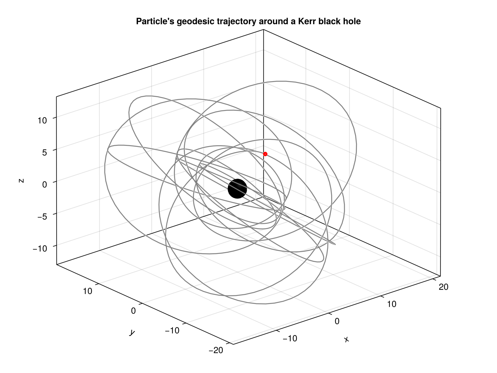

# KerrGeodesics.jl

This Julia package is a reimplementation of the Mathematica code [KerrGeodesics](https://github.com/BlackHolePerturbationToolkit/KerrGeodesics), adapted and optimized for Julia.

## Installation

You can install the package by simply typing 

```julia
using Pkg
Pkg.add("KerrGeodesics")
```

---

## Usage

### Basic Example

The main function is `Kerr_Geodesics(a, p, e, x)`, which computes the trajectory of a test particle around a Kerr black hole.

- `a`: Spin parameter of the black hole.
- `p`: Semi-latus rectum of the orbit.
- `e`: Orbital eccentricity.
- `x`: Inclination parameter.

It returns a dictionary containing all the information of the set of the parameters `(a, p, e, x)`.

```julia
using KerrGeodesics

# Example: generic Kerr geodesics with a=0.9, p=10.0, e=0.5, x=0.8 and initial phases (0.0, 0.0, 0.0, 0.0). 
KG = Kerr_Geodesics(0.9, 10.0, 0.5, 0.8; initPhases=(0.0, 0.0, 0.0, 0.0))
```

The output should be like:

```julia
Dict{String, Any} with 18 entries:
  "a"                  => 0.9
  "p"                  => 10.0
  "e"                  => 0.5
  "Cosθ_inc"           => 0.8
  "Energy"             => 0.96412
  "AngularMomentum"    => 2.83592
  "CarterConstant"     => 4.54441
  "ConstantsOfMotion"  => Dict("E"=>0.96412, "Lz"=>2.83592, "Q"=>4.54441)
  "RadialFrequency"    => 2.79272
  "PolarFrequency"     => 3.55149
  "AzimuthalFrequency" => 3.73576
  "Frequencies"        => Dict("ϒt"=>171.093, "ϒr"=>2.79272, "ϒθ"=>3.55149, "ϒϕ"=>3.73576)
  "RadialRoots"        => [20.0, 6.66667, 1.44177, 0.271714]
  "Parametrization"    => "Mino"
  "FourVelocity"       => Function[ut_contrav, ur_contrav, uθ_contrav, uφ_contrav]
  "Trajectory"         => Function[t, r, θ, ϕ]
  "CrossFunction"      => Function[tr, tθ, ϕr, ϕθ]
  "InitialPhases"      => (0.0, 0.0, 0.0, 0.0)
  "Type"               => ["Bound", "Eccentric", "Inclined"]
```

---

## Visualization Example



You can find an example of how to visualize your results in [example](example/Test_KerrGeodesics.ipynb)

## License
The package is licensed under the MIT License.
