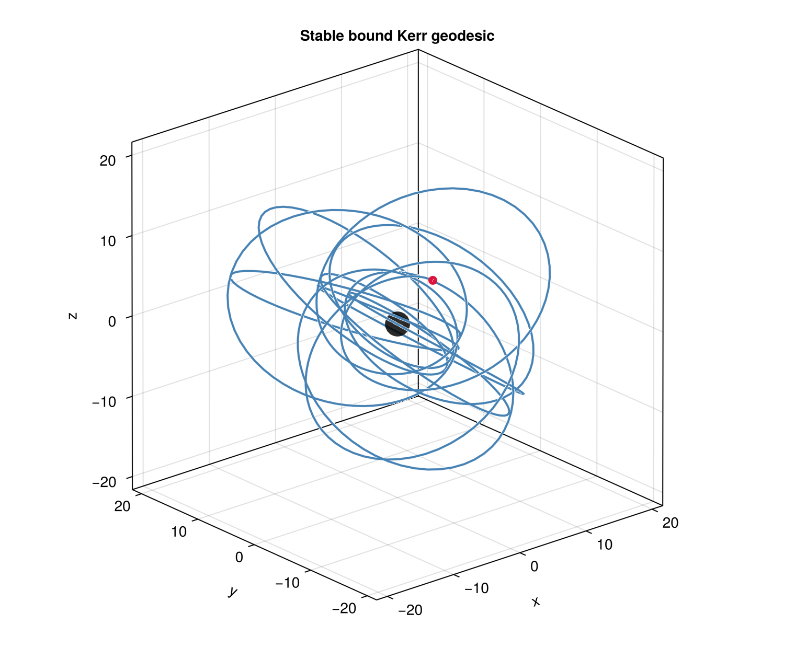
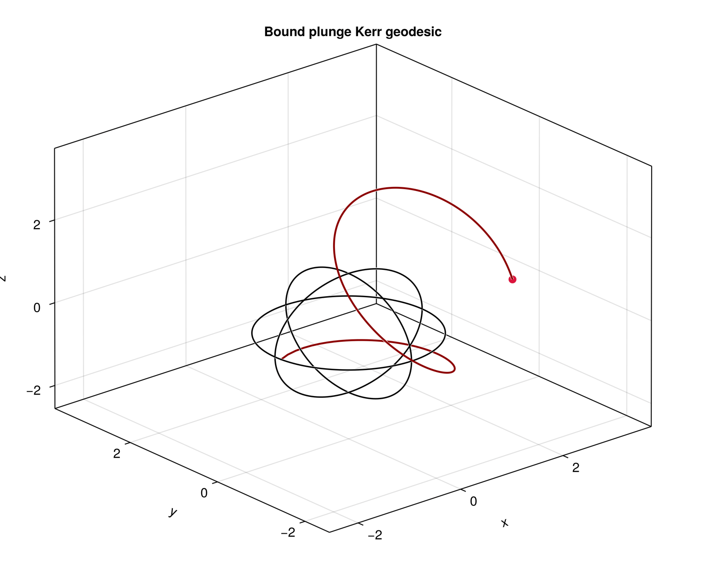

# KerrGeodesics.jl


[](https://github.com/CuberYyc808/KerrGeodesics.jl/releases)
[](https://CuberYyc808.github.io/KerrGeodesics.jl)

Julia interfaces for Kerr geodesic trajectories in units with `G = c = M = 1`.

Current support:

- stable bound orbits from APEX-like parameters `(a,p,e,x)`;
- bound plunge orbits from constants `(a,E,Lz,Q)`, with `E < 1`.

Scattering orbits are planned for future development.

## Installation

```julia
using Pkg
Pkg.add("KerrGeodesics")
```

## Basic Usage

```julia
using KerrGeodesics

stable = kerr_geo_stable(0.9, 10.0, 0.5, 0.8)
plunge = kerr_geo_plunge(0.9, 0.94, 0.1, 12.0; radial_start=:turning_point)
family = kerr_geodesic(0.9, 10.0, 0.5, 0.8)
```

Typical printed outputs are:

```julia
KerrGeoStable(
    OrbitalParameters = (a = 0.9, p = 10.0, e = 0.5, x = 0.8),
    ConstantsOfMotion = (E = 0.9641204328952226, Lz = 2.8359152778998453, Q = 4.544408272395823),
    OrbitalType = ["Bound", "Eccentric", "Stable", "Inclined"],
    Frequencies = (ϒt = 171.0926187383033, ϒr = 2.792721794117058, ϒθ = 3.551489601048812, ϒϕ = 3.7357605214030265),
    Parametrization = "Mino",
    Trajectory = (t = t(λ), r = r(λ), θ = θ(λ), ϕ = ϕ(λ)),
    InitialPhases = (qt0 = 0.0, qr0 = 0.0, qθ0 = 0.0, qϕ0 = 0.0),
)
```

```julia
KerrGeoPlunge(
    ConstantsOfMotion = (E = 0.94, Lz = 0.1, Q = 12.0),
    OrbitClass = "Complex",
    Parametrization = "Mino",
    InitialPosition = (t0 = 0.0, r0 = 3.203955290691315, theta0 = 1.5707963267948966, phi0 = 0.0),
    Trajectory = (t = t(lambda), r = r(lambda), theta = theta(lambda), phi = phi(lambda), rstar = rstar(lambda), u = u(lambda), v = v(lambda), u_rstar_series = u(rstar), v_rstar_series = v(rstar)),
    Velocity = (ut = ut(lambda), ur = ur(lambda), uz = dz/dlambda, utheta = dtheta/dlambda, uphi = uphi(lambda)),
)
```

```julia
KerrGeodesicFamily(
    InputType = :apex,
    Parameters = (a = 0.9, p = 10.0, e = 0.5, x = 0.8),
    ConstantsOfMotion = (E = 0.9641204328952226, Lz = 2.8359152778998453, Q = 4.544408272395823),
    RootClass = "Real1",
    HasStable = true,
    HasPlunge = true,
    Status = (supported = true, reason = "ok"),
)
```

The family object stores the two compatible orbit objects directly:

```julia
family.Stable
family.Plunge
```

For example:

```julia
family.Stable.Trajectory.r(0.0)
# 6.666666666666667

family.Plunge.OrbitClass
# "Real1"

family.Plunge.Status.duration.mino_time_to_horizon
# 0.05426602766253312
```

For a stable eccentric orbit, `initPhases=(0,0,0,0)` starts the radial motion at
periapsis, `r(0)=p/(1+e)`. For a bound plunge, `radial_start=:turning_point`
starts at the exterior turning point.

## Examples

The example notebook builds both stable and bound-plunge trajectory animations:

- [`example/Test_KerrGeodesics.ipynb`](example/Test_KerrGeodesics.ipynb)
- [`example/generate_example_gifs.jl`](example/generate_example_gifs.jl)

Generated example images:





## Citation

If you use this code to compute Kerr geodesics, please cite:

```bibtex
@article{Yin:2025kls,
    author = "Yin, Yucheng and Lo, Rico K. L. and Chen, Xian",
    title = "{Gravitational radiation from Kerr black holes using the Sasaki-Nakamura formalism: waveforms and fluxes at infinity}",
    eprint = "2511.08673",
    archivePrefix = "arXiv",
    primaryClass = "gr-qc",
    doi = "10.1103/9ngz-k1lr",
    journal = "Phys. Rev. D",
    volume = "113",
    pages = "124007",
    year = "2026"
}
```

## License

The package is licensed under the MIT License.
