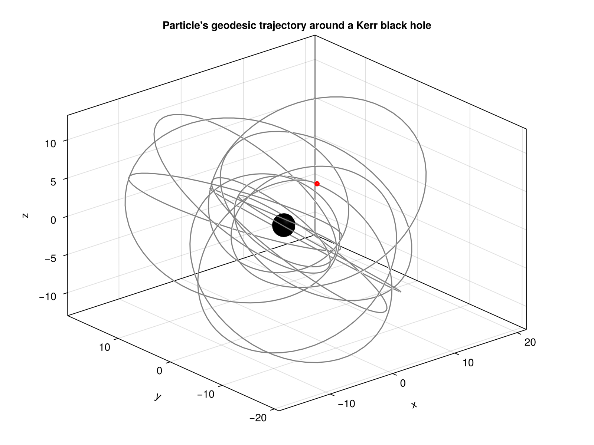

# KerrGeodesics.jl

KerrGeodesics.jl provides Julia interfaces for Kerr geodesic trajectories in
units with `G = c = M = 1`. The package currently supports stable bound orbits
from APEX-like parameters and bound plunge orbits from constants of motion,
where bound plunge means `E < 1`. Scattering-orbit support is planned for
future development.

## Documentation

The package includes a Documenter.jl site under [`docs/`](docs/), with pages
for the package overview, examples, and API reference. The GitHub Actions
workflow `.github/workflows/documentation.yml` builds and deploys the site for
the `main` branch and tags when the repository secrets are configured.

## Installation

You can install the package by simply typing 

```julia
using Pkg
Pkg.add("KerrGeodesics")
```

---

## Usage

### Unified Interface

The main project-facing function is `kerr_geodesic`.

Stable geodesic input uses the APEX-like parameters `(a, p, e, x)`:

```julia
using KerrGeodesics

geo = kerr_geodesic(0.9, 10.0, 0.5, 0.8)
```

Plunge geodesic input uses constants `(a, E, Lz, Q)` through either a constants tuple or `input=:constants`:

```julia
using KerrGeodesics

plunge = kerr_geodesic(0.9, (0.94, 0.1, 12.0); radial_start=:turning_point)
plunge_alt = kerr_geodesic(0.9, 0.94, 0.1, 12.0; input=:constants)
```

The direct plunge constructor is also available:

```julia
orbit = kerr_geo_plunge(0.9, 0.94, 0.1, 12.0; radial_start=:turning_point)
t = orbit.Trajectory.t
r = orbit.Trajectory.r
theta = orbit.Trajectory.theta
phi = orbit.Trajectory.phi
rstar = orbit.Trajectory.rstar
u = orbit.Trajectory.u
v = orbit.Trajectory.v
duration = orbit.Status.duration
```

The structured output is printed as:

```julia
KerrGeoPlunge(
    ConstantsOfMotion = (E = 0.94, Lz = 0.1, Q = 12.0),
    OrbitClass = "Complex",
    Parametrization = "Mino",
    InitialPhases = (t0 = 0.0, radial = 1.6863825015685567, theta = 0.0, phi0 = 0.0),
    Status = (supported = true, reason = "ok"),
    Trajectory = (t = t(lambda), r = r(lambda), theta = theta(lambda), phi = phi(lambda), rstar = rstar(lambda), u = u(lambda), v = v(lambda), u_rstar_series = u(rstar), v_rstar_series = v(rstar)),
    Velocity = (ut = ut(lambda), ur = ur(lambda), uz = dz/dlambda, utheta = dtheta/dlambda, uphi = uphi(lambda)),
)
```

`generic_plunge_velocity` returns `uz = dz/dlambda`. Use `orbit.Velocity.utheta` when `dtheta/dlambda` is needed.

The older stable-orbit entry point is still available as `kerr_geo_stable(a, p, e, x)`.

The combined return type from `kerr_geodesic` is `KerrGeodesicFamily`. The older
names `KerrGeodesicS` and `KerrGeodesicSet` are retained as compatibility
aliases.

### Orbit Classification

`kerr_geo_orbit_type_metadata(a,p,e,x)` returns structured stable-orbit
metadata. `kerr_geo_orbit_type(a,p,e,x)` labels are derived from that metadata.
Near the separatrix, inputs within the current roundoff guard are evaluated at
the separatrix radius and labeled `Separatrix`. Plunge labels use `Plunge` with
`BoundPlunge` or `InfinityStart`; `Unstable` is not used as an orbit-type label.

### Release Automation

The repository includes GitHub Actions workflows for CI, Documenter docs,
CompatHelper, and Julia TagBot. TagBot creates tags/releases after Julia package
registration events; it does not register the package by itself. If tag-triggered
documentation deployment is desired, configure the `DOCUMENTER_KEY` repository
secret.

### Initial Phases and Initial Positions

Stable trajectories use `initPhases=(qt0, qr0, qtheta0, qphi0)`. These are
phase offsets used by the stable-orbit analytic trajectory functions:

- `qt0` shifts the coordinate-time phase;
- `qr0` shifts the radial phase;
- `qtheta0` shifts the polar phase;
- `qphi0` shifts the azimuthal phase.

For eccentric stable bound orbits, `initPhases=(0,0,0,0)` starts the radial
motion at the inner radial turning point, i.e. periapsis with
`r(0)=p/(1+e)`. The polar phase starts at the polar turning point
`theta(0)=acos(zm)` for non-equatorial generic orbits. For circular equatorial
orbits the radius and polar angle are constant, `r(0)=p` and `theta(0)=pi/2`.

The stable four-velocity helper uses only the radial and polar phase offsets:
`kerr_geo_four_velocity(...; initPhases=(qr0, qtheta0))`.

Plunge trajectories use either explicit phases or initial-position helpers:

```julia
orbit = kerr_geo_plunge(a, E, Lz, Q; initPhases=(t0, lambda_r0, lambda_theta0, phi0))
orbit = kerr_geo_plunge(a, E, Lz, Q; radial_start=:turning_point)
orbit = kerr_geo_plunge(a, E, Lz, Q; initial_radius=r0, initial_theta=theta0)
orbit = kerr_geo_plunge(a, E, Lz, Q; radial_phase=lambda_r0, theta_phase=lambda_theta0)
```

For plunge orbits:

- `t0` and `phi0` are additive offsets in `t(lambda)` and `phi(lambda)`;
- `lambda_r0` is the radial Mino-time phase offset;
- `lambda_theta0` is the polar Mino-time phase offset;
- `radial_start=:turning_point` starts the bound plunge at the exterior
  radial turning point;
- `initial_radius` is converted to `lambda_r0` with `lambda_of_r`;
- `initial_theta` is converted to `lambda_theta0` through the polar root
  relation when the polar sector is nondegenerate;
- for equatorial or otherwise degenerate polar sectors, `initial_theta`
  defaults to `pi/2` and the polar phase is set to zero.

Bound plunge outputs include duration metadata:

```julia
orbit.Status.duration.mino_time_to_horizon
orbit.Status.duration.horizon_lambda
orbit.Status.duration.coordinate_time_to_horizon_status
```

The Mino-time duration to the event horizon is finite. Boyer-Lindquist
coordinate time and retarded time diverge at the future horizon; the advanced
time has a finite horizon anchor.

### Retarded and Advanced Time

Plunge trajectories expose the Kerr tortoise coordinate and null coordinates:

```julia
rstar = orbit.Trajectory.rstar(lambda)
u = orbit.Trajectory.u(lambda)  # t(lambda) - rstar(lambda)
v = orbit.Trajectory.v(lambda)  # t(lambda) + rstar(lambda)
```

The tortoise convention is

```julia
rstar = r + 2*rplus/(rplus-rminus)*log((r-rplus)/2) -
        2*rminus/(rplus-rminus)*log((r-rminus)/2)
```

with `rplus = 1 + sqrt(1-a^2)` and `rminus = 1 - sqrt(1-a^2)`. This real-valued
coordinate is defined for exterior radii `r > rplus`; it returns `NaN` for
`r <= rplus`. Near the horizon, use these fields with an explicit finite-cutoff
convention; the package does not claim an exact horizon-crossing or
cutoff-independent retarded time.

With `time_origin=:future_horizon_v_zero`, supported bound plunges shift
the additive coordinate-time origin so the future-horizon advanced-time anchor
satisfies `v_H=0`. Near-horizon `u(rstar)` and `v(rstar)` series callables are
exposed through `orbit.Trajectory.u_rstar_series` and
`orbit.Trajectory.v_rstar_series` when the branch supports the B50-compatible
series construction. The main trajectory remains parameterized by Mino time; the
series is a near-horizon evaluator, not a replacement for `lambda -> rstar`.

### Internal Layout

The public API is exported from `src/KerrGeodesics.jl`. Plunge near-horizon time
helpers live in `src/KerrGeoPlunge/NearHorizonTime.jl`, and plunge
initial-condition conversion helpers live in
`src/KerrGeoPlunge/InitialConditions.jl`. These internal modules keep the main
wrapper file focused on public constructors and structured output types.

---

## Visualization Example



You can find an example of how to visualize your results in [example](example/Test_KerrGeodesics.ipynb)

## License
The package is licensed under the MIT License.
