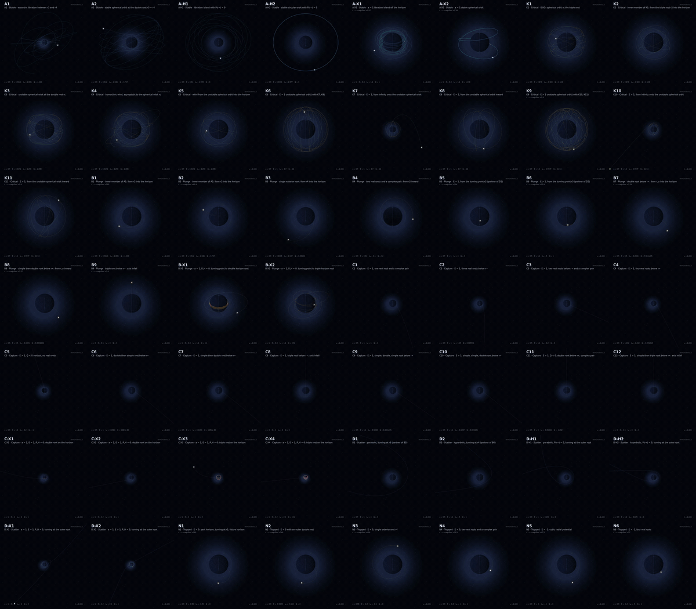

# KerrGeodesics.jl


[](https://github.com/CuberYyc808/KerrGeodesics.jl/releases)
[](https://CuberYyc808.github.io/KerrGeodesics.jl)

Timelike geodesics outside a Kerr black hole. Give the spin `a` and the constants of motion
`(E, Lz, Q)`: KerrGeodesics.jl finds every orbit these constants allow and returns its
trajectory, four-velocity and frequencies as functions of Mino time `λ`
(`G = c = M = 1`, Boyer–Lindquist coordinates, `dτ/dλ = Σ = r² + a² cos²θ`).

<p align="center">
  
</p>

The animation shows 56 orbits, one for each kind of radial motion the package distinguishes,
row by row in six classes. Each tile draws `(x, y, z) = (r sinθ cosϕ, r sinθ sinϕ, r cosθ)`
(units of `M`, spin along `z`), with the outer horizon as the black sphere and the ergosphere as
the wireframe; `ϕ` is the azimuth `φ` (or `ψ = φ + φ_H` for orbits that cross a horizon) and the
frames show the progression along each trajectory. The constants `(a, E, Lz, Q)` are
printed on the tiles and recorded in the
[catalogue notebook](example/KerrGeodesics_56_Orbit_Catalog.ipynb);
[`example/data/catalogue_registry.tsv`](example/data/catalogue_registry.tsv) lists their
root structures, allowed intervals and formula families.

| Class | Motion | Orbits |
|---|---|---|
| Stable | bound between two turning points, or on a stable circular or spherical orbit | 6 |
| Critical | on, or asymptotic to, an unstable or marginally stable circular or spherical orbit (ISCO and ISSO, homoclinic and whirl orbits) | 11 |
| Plunge | from a turning point into the black hole | 11 |
| Capture | from infinity into the black hole (`E ≥ 1`) | 16 |
| Scatter | from infinity through a turning point and back to infinity (`E ≥ 1`) | 6 |
| Trapped | `E < 0`, inside the ergoregion: out of the past horizon, through a turning point, into the future horizon | 6 |

Within a class, the orbits differ in how the roots of the radial potential are arranged. The
grid includes the limiting cases in which the horizon is itself a root and those of an
extremal black hole (`|a| = 1`).

## Installation

```julia
using Pkg
Pkg.add("KerrGeodesics")
```

## Usage

```julia
using KerrGeodesics

kg = kerr_geodesic(0.9, (0.9641, 2.8359, 4.5444))   # spin a, constants (E, Lz, Q)
kg = kerr_geodesic(0.9, 10.0, 0.5, 0.8)             # or spin a and (p, e, x) of an orbit with a periapsis
```

`kg` holds the orbits these constants allow, by class: `kg.Stable`, `kg.Critical`, `kg.Plunge`,
`kg.Capture`, `kg.Scatter` and `kg.Trapped` (`nothing` when absent; `kg.Critical` is a tuple).
Here there are two, a stable orbit and the plunge with the same constants, and
`kerr_geo_members(kg)` lists them. Every orbit is used in the same way.

**Trajectory.** `t`, `r`, `theta`, `phi` and the proper time `tau` as functions of `λ`, on the
range `Domain.mino`:

```julia
λ = 1.0
kg.Stable.Trajectory.r(λ)                  # likewise t, theta, phi, tau

λH = kg.Plunge.Domain.mino[2]              # the plunge reaches the horizon at λH
kg.Plunge.Trajectory.v(λH)                 # the horizon-regular coordinates v and psi stay finite there
```

**Four-velocity.** `Velocity` holds the Mino-time rates `dx^μ/dλ` (`ut`, `ur`, `utheta`, `uphi`)
and `dtau_dlambda = Σ`; the four-velocity `u^μ = dx^μ/dτ` is their ratio. For a stable orbit
given by `(a, p, e, x)`, `kerr_geo_four_velocity` returns it directly (`Covariant=true` for `u_μ`).

```julia
kg.Stable.Velocity.ut(λ) / kg.Stable.Velocity.dtau_dlambda(λ)   # u^t; likewise ur, utheta, uphi
kerr_geo_four_velocity(0.9, 10.0, 0.5, 0.8)                     # [u^t, u^r, u^θ, u^φ] as functions of λ
```

**Orbital parameters.**

```julia
kg.Stable.ConstantsOfMotion                # (a, E, Lz, Q)
kg.Stable.Status.apex                      # (a, p, e, x)
kg.Stable.Roots.radial                     # roots of the radial potential, largest first: apoapsis, periapsis, …
```

**Frequencies.**

```julia
kg.Stable.Status.frequencies                                        # Mino frequencies (ϒt, ϒr, ϒθ, ϒϕ)
kerr_geo_frequencies(0.9, 10.0, 0.5, 0.8; Time="BoyerLindquist")    # Ωr, Ωθ, Ωϕ, each ϒ/ϒt
```

`Time="Mino"` and `Time="Proper"` give the Mino-time and proper-time frequencies.

**Many points at once.**

```julia
kerr_geo_sample(kg.Stable, range(0, 20; length=10_000))   # vectors t, r, theta, phi, tau and the rates ut, ur, utheta, uphi
```

**Precision.** Everything is computed in `Float64` by default. For more digits, pass `BigFloat`
numbers or `precision = p` (bits); see
[Arbitrary precision](https://CuberYyc808.github.io/KerrGeodesics.jl/stable/arbitrary_precision/).

```julia
kg = kerr_geodesic(9//10, (19//20, 3, 4); precision=256)
```

The rationals `9//10` and `19//20` are exactly 0.9 and 0.95, rounded once to 256 bits. The
literals `0.9` and `0.95` are `Float64` numbers, whose exact values are

```
0.9  → 0.90000000000000002220446049250313080847263336181640625
0.95 → 0.9499999999999999555910790149937383830547332763671875
```

With `precision=256` these are converted unchanged, so the orbit would be computed for
a = 0.90000000000000002220… rather than for a = 0.9.

New in 0.5.0: every orbit is computed in the precision of its input, as above. Bound orbits given
by `(p, e, x)` keep their turning points `p/(1 ∓ e)`, so they stay bound and accurate up to the
separatrix.

## Examples

[`example/KerrGeodesics_Tutorial.ipynb`](example/KerrGeodesics_Tutorial.ipynb) walks through
the conventions, the classification, one example per class (Stable, Critical, Plunge,
Capture, Scatter, and Trapped with `E < 0`), polar options, the horizon-regular coordinates,
the four-velocity and self-checks (`kerr_geo_diagnose`), the APEX interface and the accuracy
limits. The 56 orbits above, with their constants, are in
[`example/KerrGeodesics_56_Orbit_Catalog.ipynb`](example/KerrGeodesics_56_Orbit_Catalog.ipynb).

## Citation

If you use this code to compute Kerr geodesics, please cite:

```bibtex
@article{Yin:2025kls,
    author = "Yin, Yucheng and Lo, Rico K. L. and Chen, Xian",
    title = "{Gravitational radiation from Kerr black holes using the Sasaki-Nakamura formalism: waveforms and fluxes at infinity}",
    eprint = "2511.08673",
    archivePrefix = "arXiv",
    primaryClass = "gr-qc",
    doi = "10.1103/9ngz-k1lr",
    journal = "Phys. Rev. D",
    volume = "113",
    pages = "124007",
    year = "2026"
}
```

## License

The package is licensed under the MIT License.
